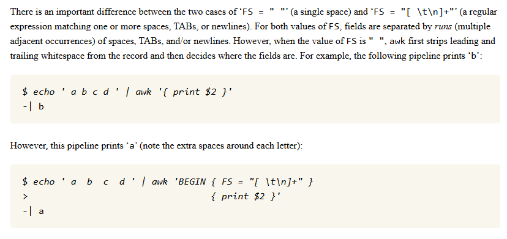
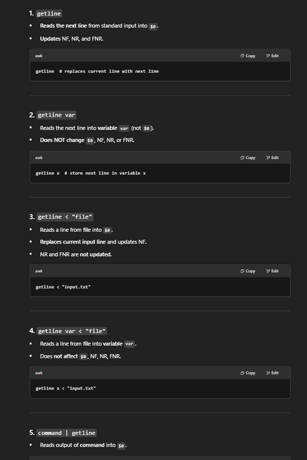

# TSC TIME
## sudo bash bash bash

### bash basics

- **`echo -e`** enables escape chars — `\e[31m`=red, `32m`=green, `34m`=blue, `0m`=reset

---

- **Word splitting** — bash collapses unquoted whitespace and splits on `$IFS`
```bash
a="1  2  3"
for i in $a;   do echo "$i"; done   # splits: 1 / 2 / 3
for i in "$a"; do echo "$i"; done   # no split: "1  2  3"
```

- Variables defined **without spaces** around `=`
```bash
foo="abc    def"; bar=1234
echo $foo$bar      # abc def1234       (word splitting ✓)
echo "$foo$bar"    # abc    def1234    (word splitting ✗)
echo "${foo}XX"    # abc    defXX      (${} to delimit var name)
```

- **Quoting rules:**
  - no quotes → word splitting + glob substitution
  - `"..."` → no splitting, but `$ \` `` ` `` still special
  - `'...'` → everything literal

> [!warning]
> `ls *.sh` matches files ending in `.sh` — `ls "*.sh"` looks for a file literally named `*.sh`

---

#### Variable defaults

**`${var:-default}`** — use `default` if `var` is unset or empty

| Syntax | Meaning |
|--------|---------|
| `${var:-val}` | use `val` if unset/empty |
| `${var:=val}` | use `val` AND assign to `var` if unset/empty |
| `${var:+val}` | use `val` if set (opposite) |
| `${var:?msg}` | error + exit if unset/empty |

---

### ways of running a script

| Method | Current Shell | Needs `chmod +x` | Vars persist | Shebang |
| --- | --- | --- | --- | --- |
| `source a.sh` | YES | NO | YES | NO |
| `./a.sh` | NO (child) | YES | NO | YES |
| `bash a.sh` | NO (child) | NO | NO | NO |

---

### Env vars
Print all using **`env`**

| Variable | Description | Example |
| --- | --- | --- |
| `$HOME` | home directory | `/home/user` |
| `$PATH` | colon-separated executable dirs | `/usr/local/bin:/usr/bin` |
| `$PWD` / `$OLDPWD` | current / previous working dir | |
| `$SHELL` | current shell binary | `/bin/bash` |
| `$USER` / `$UID` / `$EUID` | user name / id / effective id | |
| `$IFS` | internal field separator (word splitting!) | `<space><tab><newline>` |
| `$PS1` / `$PS2` | primary / secondary prompt | `\u@\h:\w\$` |
| `$?` | last exit status (0=success) | |
| `$$` / `$!` | PID of shell / last bg process | |
| `$0` | script name | |
| `$1, $2...` / `$#` | positional args / arg count | |
| `$@` | all args as separate strings | |
| `$*` | all args as one string | |
| `$RANDOM` | random 0–32767 | |
| `$LINENO` | current line number | |

---

### conditional love

> [!note] **Always use spaces inside `[ ]` and `[[ ]]` — bash tokenizes on whitespace**

| Feature | `[ ]` | `[[ ]]` | `(( ))` |
| --- | --- | --- | --- |
| Use for | basic (deprecated) | strings + regex | arithmetic |
| Int compare | `-eq -lt -gt` | `-eq -lt -gt` | `< > == !=` |
| Str compare | `== !=` (quoted) | `== != > < =~` | ✗ |
| Logical | `-a -o !` | `&& \|\| !` | `&& \|\| !` |
| Word splitting | YES | NO | NO |
| File tests | `-f -d -e` | `-f -d -e` | NO |
| `$` prefix | required | preferred | not needed |

> [!note]
> In `[[ ]]`, `>` and `<` are **lexicographic** — `[[ 10 > 2 ]]` is false. Use `-gt`/`-lt` for numbers.

String tests: **`-z`** empty, **`-n`** non-empty
File tests: **`-e`** exists, **`-f`** file, **`-d`** dir, **`-s`** non-empty, **`-r/w/x`** perms

---

#### Arithmetic — `let`, `(( ))`, `$(( ))`

```bash
let "a = 5 + 4"   # evaluates in place, a=9
let "a++"          # a=10
declare -i num     # forces integer; num="asdf" → 0, num=7.5 → error
```

> [!note] **`(( ))` vs `$(( ))`**

**`(( ))`** — evaluates, returns exit status (nonzero result = true, zero = false)
```bash
if (( a > b )); then echo "yes"; fi

y=1
(( y+=1 )) && echo "non-zero" || echo "zero"   # non-zero
(( y-=2 )) && echo "non-zero" || echo "zero"   # zero
```

**`$(( ))`** — evaluates and **returns the value**
```bash
result=$(( a + b ))
echo "next: $(( i + 1 ))"
```

---

#### Floating-point with `bc`

Bash truncates integer division — `4/3` → `1`. Use `bc`:

```bash
echo "3/4" | bc -l                           # .75000...  (-l sets scale=20)
echo "scale=3; 10 / 3" | bc                  # 3.333
echo "(5/3 + 1) * 3 ; 5 < 3 ; 10 > 2" | bc  # 6 / 0 / 1
```

**`-l`** loads mathlib: `s(x)` `c(x)` `l(x)` `e(x)` `a(x)` = sin, cos, log, exp, arctan; also `sqrt(x)`

> [!note]
> ```
> exit code 0 == SUCCESS == TRUE
> exit code 1 == FAILURE == FALSE
> ```
> applies to commands AND conditional expressions `((...))`, `[...]`, etc.

---

### control flow and loops

```bash
if [[ -f file.txt ]]; then
    echo "file"
elif [[ -d file.txt ]]; then
    echo "dir"
fi

# use command exit status directly
if ls somedir &>/dev/null; then echo "exists"; fi

# $? anti-pattern — prefer the above
some_cmd
if [[ $? -ne 0 ]]; then echo "failed"; fi   # ok but verbose
```

> [!warning] **No parentheses in bash `for`**

```bash
for i in foo bar baz; do echo "$i"; done        # foo / bar / baz
for i in "foo bar baz"; do echo "$i"; done      # foo bar baz  (one element)
for i in {1..5..2}; do echo "$i"; done          # 1 3 5  (start..end..step)
for i in "${arr[@]}"; do echo "$i"; done        # iterate array safely
```

```bash
a=5
while (( a < 7 )); do echo $((a++)); done   # 5 6 ; a=7

b=5
until (( b > 7 )); do echo $((b++)); done   # 5 6 7 ; b=8
```

---

#### Functions

- **`return n`** — return exit status code
- **`exit n`** — exit the whole script
- **Return values via stdout** — capture with `$(fn)`

```bash
factorial() {
    if [[ $1 -le 1 ]]; then
        echo 1
    else
        local temp=$(( $1 - 1 ))
        local result=$(factorial "$temp")
        echo $(( $1 * result ))
    fi
}
```

- **`local`** — scoped to function; default is global
- **`export`** — visible to child processes

---

#### Reading input

```bash
while IFS= read -r line; do    # IFS= preserves leading whitespace
    echo "$line"
done < "$file"
```

| Option | Meaning |
| --- | --- |
| **`-r`** | raw — don't interpret `\` |
| `-p` | prompt string |
| `-a` | read into array |
| `-n N` | read N chars |
| `-s` | silent (passwords) |
| `-t N` | timeout N seconds |

> [!note] **Heredoc vs herestring**
> ```bash
> cmd <<EOF          # heredoc — multi-line, var expansion on
> cmd <<"EOF"        # heredoc — var expansion OFF
> cmd <<< "string"   # herestring — single string
> ```
> **Split CSV into array:** `IFS=',' read -ra arr <<< "a,b,c"`

---

#### pretty printing

**`printf "FORMAT" args`** — like C printf, repeats format for multiple arg sets

| Spec | Meaning | Example |
| --- | --- | --- |
| `%-10s` | left-align in 10 chars | `"abc"` → `"abc       "` |
| `%5s` | right-align | `"abc"` → `"  abc"` |
| `%04d` | zero-pad int | `5` → `0005` |
| `%.2f` | 2 decimal places | `3.14159` → `3.14` |
| `%x` | hex | `32` → `20` |

```bash
printf "Line: %d\n" {1..3}                  # repeats format per arg
greeting=$(printf "Hello, %s!" "$name")     # capture with $()
```

---

#### Arrays

```bash
arr=(foo bar baz "ohio rizz")   # 0-indexed

echo "${arr[1]}"          # bar
echo "${arr[@]}"          # all elements
echo "${#arr[@]}"         # count

echo "${arr[@]:1:2}"      # bar baz      (slice: start, len)
echo "${arr[@]: -2}"      # baz "ohio rizz"  (from end)

unset 'arr[1]'            # deletes element, leaves hole
```

> [!warning] **Deleted slots leave holes** — `${#arr[@]}` counts remaining elements but indices don't repack. Same gotcha as JS sparse arrays.

---

#### Assoc Arrays (Bash 4+)

```bash
declare -A capitals
capitals[India]="New Delhi"
capitals[France]="Paris"

echo "${!capitals[@]}"    # all keys
echo "${capitals[@]}"     # all values

for k in "${!capitals[@]}"; do
    echo "$k => ${capitals[$k]}"
done
```

---

### Shell Globbing

| Pattern | Matches |
|---------|---------|
| `*` | zero or more chars (not `/`) |
| `?` | exactly one char |
| `[abc]` | one char from set |
| `[a-z]` | one char in range |
| `[^abc]` / `[!abc]` | negation |

**Extended** (`shopt -s extglob`):

| Pattern | Meaning |
|---------|---------|
| `?(pat)` | zero or one |
| `*(pat)` | zero or more |
| `+(pat)` | one or more |
| `@(pat)` | exactly one |
| `!(pat)` | anything except |

Use `|` for alternatives inside parens: `+(foo|bar)`

**`shopt` flags:**

| Flag | Effect |
|------|--------|
| `nullglob` | unmatched glob → empty (not literal) |
| `failglob` | unmatched glob → error |
| `dotglob` | `*` includes dotfiles |
| `globstar` | `**` matches recursively |

---

#### Prefix/Suffix Removal

**`%`/`#` = trim from end/start; double = greedy**

```bash
str="report_final_version.txt"
echo "${str%_*}"    # report_final       (end, short)
echo "${str%%_*}"   # report             (end, greedy)
echo "${str#*_}"    # final_version.txt  (start, short)
echo "${str##*_}"   # version.txt        (start, greedy)
```

**Idiomatic uses:**
```bash
path="/usr/local/bin/"
echo "${path%/}"          # /usr/local/bin      (strip trailing slash)

url="https://example.com/foo/bar"
echo "${url##*/}"         # bar                 (basename)
echo "${url%/*}"          # https://example.com/foo  (dirname)

file="archive.tar.gz"
echo "${file%%.*}"        # archive             (strip all extensions)
echo "${file#*.}"         # tar.gz              (after first dot)
```

> `basename`/`dirname` commands exist but parameter expansion avoids a subprocess.

---

#### Regex in `[[ =~ ]]`

**ERE** (same as `egrep`). Leave pattern **unquoted** or store in variable — quoting makes it literal.

```bash
email="foo@example.com"
[[ $email =~ ([a-z]+)@([a-z]+\.[a-z]+) ]]
echo "${BASH_REMATCH[0]}"   # full match
echo "${BASH_REMATCH[1]}"   # foo
echo "${BASH_REMATCH[2]}"   # example.com

regex='^([0-9]{4})-([0-9]{2})-([0-9]{2})$'
[[ "2025-04-25" =~ $regex ]] && echo "${BASH_REMATCH[1]}"   # 2025
```

---

### String Manipulation

```bash
str="Hello, World!"
echo ${#str}              # 13           (length)
echo ${str:7:5}           # World        (substr: start, len)
echo ${str:7}             # World!       (to end)

echo ${str/World/Bash}    # Hello, Bash! World!   (first)
echo ${str//World/Bash}   # Hello, Bash! Bash!    (global)

echo ${str^^}             # HELLO, WORLD!   (upper)
echo ${str,,}             # hello, world!   (lower)
echo ${str^}              # Hello, World!   (first char only)
```

Whitespace trimming (gnarly but pure bash — or just use `awk '{$1=$1};1'`):
```bash
trimmed="${str#"${str%%[![:space:]]*}"}"    # leading
trimmed="${str%"${str##*[![:space:]]}"}"    # trailing
```

---

### Redirection & File Descriptors

**`0`**=stdin **`1`**=stdout **`2`**=stderr

```bash
echo "err" >&2          # stdout → stderr
cmd 2>&1                # stderr → stdout
cmd 2>/dev/null         # silence stderr
cmd &>/dev/null         # silence both
cmd >out.txt 2>&1       # both to file ✅
cmd 2>&1 >out.txt       # ❌ stderr → terminal, stdout → file
```

> [!warning] **Order matters** — `2>&1` snapshots where stdout points *at that moment*

`&>file` is bash shorthand only — not POSIX. `2&>1` is **not valid**.

---

### bashception

| Command | Mechanism | Shell Level | Behavior |
| --- | --- | --- | --- |
| **`$(cmd)`** | Subshell | Child | Captures stdout as string |
| **`exec`** | Overlay | Replacement | Replaces current process image |
| **`eval`** | Re-parse | Current | Executes string as shell syntax |

---

#### `$( )` Command Substitution
```bash
current_user=$(whoami)
echo "The date is $(date +%D)"
```

#### `exec`
**Replaces the current shell** — nothing after it runs.
```bash
exec top                          # terminal becomes top; close top = session ends
exec ./my_heavy_application       # hand off to binary in wrapper scripts
```

#### `eval`
**Re-parses a string as shell syntax** — pipes, redirects, expansions all work.
```bash
task="ls -l | sort -r"
eval $task

eval "USER_$name=$val"            # dynamic variable names

pointer="target"; target="Hello"
eval "echo \$$pointer"            # indirect reference → Hello

range="{1..5}"
eval echo $range                  # brace expansion → 1 2 3 4 5
```

**Key use case — environment hooks:**
```bash
eval $(ssh-agent -s)   # output contains export statements; eval applies them to current shell
```

---

# sed

### Invocation

```bash
sed [OPTIONS] [SCRIPT] [INPUT]
```

| Flag | Meaning |
| --- | --- |
| `-e script` | inline script |
| `-f file` | script from file |
| **`-n`** | suppress auto-print |
| `-i[SUFFIX]` | in-place (optional backup) |
| `-E` / `-r` | extended regex |

---

### Addressing

| Address | Effect |
| --- | --- |
| `N` | line N |
| `M,N` | lines M–N |
| `/pat/` | matching lines |
| `/start/,/end/` | range (inclusive) |
| `/pat/!` | **non**-matching lines |
| `$` | last line |

```bash
sed -n '/^BEGIN/,/^END/p' file     # print between markers
sed '/ERROR/!d' log                # keep only ERROR lines
sed -n 'N;$!P;$p' file            # print second-last line
```

---

### Commands

**`d`** delete, **`p`** print, **`q`** quit, **`a`** append, **`i`** insert, **`c`** change

```bash
sed '1,5d' file                    # delete lines 1-5
sed '/^$/d' file                   # delete blank lines
sed -n '/scream/p' file            # print matching only
sed '5q' file                      # first 5 lines then quit
sed '2a tomato' fruits             # append after line 2
sed '2c aam' fruits                # replace line 2
sed '/mango/c aam' fruits          # replace matching lines
```

---

### Substitute `s/pat/repl/[flags]`

| Flag | Meaning |
| --- | --- |
| `g` | all occurrences |
| `n` | nth occurrence |
| `p` | print if substituted |
| `I` | case-insensitive |

**`&`** = whole match; **`\1 \2`** = capture groups

```bash
sed 's/wolf/fox/3gI' file                          # 3rd+ occurrence, case-insensitive
echo "AA BB" | sed 's/\([A-Z]\)\1/XX/g'            # replace doubles → XX
echo "5 apples" | sed 's/[0-9]\+/[&]/g'            # wrap numbers → [5]
echo "light bulb" | sed 's/light/tube/g; s/bulb/light/g'  # order matters!
```

---

### Non-Trivial Tricks

```bash
sed 's/\(.*\)foo/\1bar/' file          # replace LAST occurrence of foo
sed 's/.*,//' file                     # delete everything before last comma
sed -E 's/.*:([^:]+)/\1/' /etc/passwd # last colon-delimited field
sed '10,20!d' file                     # keep only lines 10-20
sed '/ERROR/{p;q;}' log               # print first ERROR then quit
```

---

### Hold Space

**Secondary buffer** — pattern space is the current line; hold space persists across lines.

| Cmd | Action |
| --- | --- |
| `h` / `H` | copy / append pattern → hold |
| `g` / `G` | copy / append hold → pattern |
| `x` | exchange |

```bash
sed -n '1!G;h;$p' file                          # reverse file (tac)
sed '$!N; /^\(.*\)\n\1$/!P; D' file             # remove consecutive duplicates
```

---

## awk

> **Mental model:** awk reads input record by record (default: one line = one record). Each record splits into fields `$1 $2 ... $NF`. You write `pattern { action }` pairs — for each record, every matching pattern's action runs.

```bash
awk 'pattern { action }' file
awk -F: '{ print $1 }' /etc/passwd           # -F sets field separator
awk -v min=25 '$2 >= min { print $1 }' file  # -v passes shell var into awk
awk -v OFS=, '{ print $1, $2 }' file         # -v sets any variable before BEGIN
awk -f script.awk file                        # load program from file
```

**`$0`** = whole record. **`$1..$NF`** = fields. Assigning to a field rewrites `$0`.

---

### Structure

```bash
awk '
BEGIN   { # runs once before any input
          FS = ":"
          count = 0
        }
/ERROR/ { # pattern: runs for matching records only
          count++
        }
        { # no pattern: runs for every record
          print $1
        }
END     { # runs once after all input
          print "total errors:", count
        }
' file
```

Patterns can be:
- **regex** `/pat/` — match against `$0`
- **comparison** `$2 > 100`
- **range** `/start/, /end/` — inclusive, toggles on/off
- **compound** `$1 == "foo" && NR > 5`
- **none** — matches every record

---

### Built-in Variables

| Variable | Meaning | Default |
| --- | --- | --- |
| **`NR`** | record number (global, across all files) | |
| **`NF`** | field count in current record | |
| **`$0`** | whole current record | |
| **`FS`** | input field separator | `" "` |
| **`OFS`** | output field separator | `" "` |
| `RS` | input record separator | `"\n"` |
| `ORS` | output record separator | `"\n"` |
| `FNR` | record number within current file (resets per file) | |
| `FILENAME` | current input file name | |

---

### FS Behavior

- **`FS=" "`** (default) — split on runs of whitespace, trim leading/trailing
- **`FS="x"`** (single char) — split on every occurrence; consecutive → empty fields
- **`FS="regexp"`** — split on regex matches
- **`FS=""`** — each character is its own field



**Changing OFS + rebuilding `$0`:**
```bash
awk 'BEGIN{FS=","; OFS="|"} {$1=$1; print}' file   # rewrite CSV → pipe-delimited
# $1=$1 forces $0 to be rebuilt with OFS
```

---

### Arithmetic & Variables

AWK variables are **untyped** — used as number or string depending on context. Uninitialized variables are `0` or `""`.

**String concatenation** — juxtapose values, no operator needed:
```bash
awk '{ full = $1 " is a " $3; print full }' file
awk '{ print $1 "_" $2 }' file
```

**Ternary operator:**
```bash
awk '{ label = ($2 >= 30) ? "senior" : "junior"; print $1, label }' file
```

**Math functions:** `sin(x)` `cos(x)` `atan2(y,x)` `exp(x)` `log(x)` `sqrt(x)` `int(x)` `rand()` `srand(seed)`

```bash
awk '{ sum += $1; count++ } END { print sum/count }' file   # average
awk '{ if ($3 > max) max = $3 } END { print max }' file    # max of col 3
awk 'NR%2 == 0 { print }' file                              # even lines only
awk 'BEGIN { srand(); print int(rand()*100) }'              # random 0-99
awk '{ print int($1) }' file                                # truncate to int
```

---

### Arrays

AWK arrays are **associative** (like hash maps). No declaration needed.

```bash
awk '{ count[$1]++ }
     END { for (k in count) print k, count[k] }' file      # word/value frequency

awk '{ seen[$0]++ } seen[$0] == 1 { print }' file          # remove duplicates

awk 'NR==FNR { a[$0]=1; next }                             # line exists in file1?
             { if ($0 in a) print }' file1 file2            # print common lines
```

- **`for (k in arr)`** — iterate keys (unordered)
- **`delete arr[k]`** — delete a key
- **`k in arr`** — test membership without creating entry (unlike `arr[k]`)
- **`delete arr`** — clear entire array

---

### Patterns in Practice

```bash
awk 'NR==1'              file    # first line only
awk 'NR>=5 && NR<=10'    file    # lines 5-10
awk '$NF > 100'          file    # last field > 100
awk '!/^#/'              file    # skip comment lines
awk '/start/,/end/'      file    # range (inclusive)
awk 'NR==FNR'            file    # true only while reading first file
```

---

### printf

Same as C. **Does not add newline automatically.**

```bash
awk '{ printf "%-15s %5d\n", $1, $2 }' file
awk 'END { printf "%.2f\n", sum/count }' file
```

| Spec | Meaning |
| --- | --- |
| `%s` | string |
| `%d` | integer |
| `%f` / `%.2f` | float / 2 decimal places |
| `%-10s` | left-align in 10 chars |
| `%05d` | zero-pad |

---

### String Functions

> [!note] Strings are **1-indexed**. Regex returns **longest leftmost match**.

- **`length(s)`**
- **`substr(s, start[, len])`**
- **`index(s, find)`** — position of `find` in `s`; 0 if not found
- **`tolower(s)`** / **`toupper(s)`**
- **`split(s, arr, delim)`** — splits into array, returns count
- **`sprintf(fmt, ...)`** — format string without printing; store in variable
- **`sub(re, repl[, target])`** — replace first match in-place (default `$0`)
- **`gsub(re, repl[, target])`** — replace all matches in-place; returns count
- **`gensub(re, repl, how[, target])`** — like gsub but **returns new string**, supports `\1` back-refs; `how="g"` or integer
- **`match(s, re[, arr])`** — sets `RSTART`/`RLENGTH`; with `arr`: `arr[0]`=full, `arr[1]`...=groups
- **`patsplit(s, arr, pat)`** — split on pattern matches instead of delimiter

```bash
awk '{ gsub(/foo/, "bar"); print }' file             # in-place replace all
awk '{ print gensub(/(\w+)/, "[\\1]", "g") }' file  # back-ref: wrap words in []
awk '{ if (match($0, /[0-9]+/, m)) print m[0] }' file   # extract first number
awk '{ s = sprintf("%-10s %d", $1, $2); print s }' file # format into variable
```

---

### Other Built-ins

**`system(cmd)`** — run a shell command; returns exit status
```bash
awk '{ system("mkdir -p " $1) }' dirs.txt        # create dirs from file
awk 'BEGIN { ret = system("ls /tmp"); print ret }' # check exit status
```

**`systime()` + `strftime(fmt, ts)`** — unix timestamp and formatting
```bash
awk 'BEGIN { print systime() }'                               # current epoch
awk 'BEGIN { print strftime("%Y-%m-%d %H:%M:%S", systime()) }'  # human readable
awk '{ print strftime("%H:%M:%S", $1), $2 }' logfile         # format epoch col
```

**`ENVIRON["var"]`** — access shell environment variables
```bash
awk 'BEGIN { print ENVIRON["HOME"] }'
awk -v user=$USER '$1 == user { print }' file   # same via -v
```

---

### getline

> **`getline [var] [< file]`** — reads next line from file into var (default `$0`). Updates `NR`/`NF` if reading from main input.



```bash
# read from a file inside awk
awk '{ getline line < "other.txt"; print $0, line }' main.txt

# read from a command
awk '{ "date" | getline d; close("date"); print $0, d }' file

# read next record from main input (skip lines)
awk '{ getline; print }' file    # print every other line (the skipped one)
```

**Returns:** `1` (ok), `0` (EOF), `-1` (error).

**`close(src)`** resets the file/command so next `getline` reads from the start again.

Idiomatic command read:
```bash
while ((cmd | getline line) > 0) { print line }
```

---

### Idiomatic One-liners

```bash
# print specific columns
awk '{ print $1, $3 }' file

# filter rows
awk '$3 > 100' file
awk '/pattern/' file

# sum a column
awk '{ sum += $2 } END { print sum }' file

# count matching lines
awk '/ERROR/ { count++ } END { print count }' file

# print line numbers
awk '{ print NR, $0 }' file

# remove blank lines
awk 'NF' file

# print last field of each line
awk '{ print $NF }' file

# print lines between markers (exclusive)
awk '/START/{found=1; next} /END/{found=0} found' file

# transpose CSV
awk -F, '{ for(i=1;i<=NF;i++) a[i]=a[i] (NR>1?",":"") $i }
          END { for(i=1;i<=NF;i++) print a[i] }' file

# frequency count + sort
awk '{ count[$1]++ } END { for (k in count) print count[k], k }' file | sort -rn

# join two files on first field
awk 'NR==FNR { a[$1]=$2; next } $1 in a { print $0, a[$1] }' file1 file2

# sed+awk pipeline: replace then process fields
sed 's/,/ /g' data.csv | awk '{ print $2 }'
```

> [!note] **`awk 'NF'`** — `NF` is 0 for blank lines, which is falsy. Clean idiom for skipping empty lines.

---

### Data Types

AWK has **two types**: strings and numbers. Variables are untyped — context decides.

```bash
x = "42"    # string
x + 0       # now numeric 42
x ""        # concatenate empty string → force string context
```

- Uninitialized variable = `0` (numeric) or `""` (string)
- **Numeric strings** — values read from input that look like numbers compare numerically: `"10" > "9"` is true if both came from input fields; false if either is a string literal
- **Arrays** are always associative; numeric indices are just string keys `"1"`, `"2"`, ...

---

### Operator Precedence (high → low)

| Precedence | Operators | Notes |
| --- | --- | --- |
| highest | `( )` | grouping |
| | `$` | field access |
| | `^` | exponentiation (right-assoc) |
| | `! - ++x --x` | unary |
| | `x++ x--` | post-increment |
| | `* / %` | |
| | `+ -` | |
| | `" "` (space) | **string concatenation** |
| | `< > <= >= == != ~ !~` | relational + regex match |
| | `in` | array membership |
| | `&&` | |
| | `\|\|` | |
| | `?:` | ternary |
| lowest | `= += -= ...` | assignment |

> [!note] String concatenation via juxtaposition has **lower** precedence than arithmetic — `print a b+c` prints `a` then `b+c` as a string, not `(a b) + c`.

---

### Regex in AWK

AWK uses **ERE** (extended regular expressions), same class as `egrep`.

**Three forms:**

```bash
/pattern/           { action }   # match $0 against literal regex
$2 ~ /pattern/      { action }   # field matches regex
$2 !~ /pattern/     { action }   # field does NOT match
```

**Dynamic regex** — store pattern in variable:
```bash
awk -v pat="ERROR|WARN" '$0 ~ pat { print }' file
```

> [!warning] When regex is a **string variable**, backslashes need doubling: to match a literal dot use `"\\."` not `"\."`.

**In functions** (`sub`, `gsub`, `gensub`, `match`, `split`):
```bash
gsub(/[0-9]+/, "NUM")           # literal regex — single backslash
gsub("[0-9]+", "NUM")           # string regex — same here, but:
gsub("\\.", "dot")              # match literal dot — must double backslash
```

**ERE syntax quick ref:**

| Pattern | Meaning |
| --- | --- |
| `.` | any char except newline |
| `*` `+` `?` | 0+, 1+, 0 or 1 |
| `{n,m}` | repeat n to m times |
| `^` `$` | start/end of record |
| `[abc]` `[^abc]` | char class / negation |
| `(a\|b)` | alternation |
| `(pat)` | grouping (for `gensub` back-refs) |

---

### Field Separator Variants

`FS` (or `-F`) can be:

| Value | Behavior |
| --- | --- |
| `" "` (default) | split on **runs** of whitespace; trims leading/trailing |
| `","` single char | split on every occurrence; consecutive → empty fields |
| `"\t"` | tab-delimited |
| `"[,;]"` | **character class** — any of `,` or `;` |
| `":+"` | **regex** — one or more colons |
| `""` | each individual character becomes a field |
| `"\n"` | each line is one field (combine with `RS=""` for paragraph mode) |

```bash
awk -F'[,;|]'  '{ print $1 }' file       # any of those chars
awk -F'\t'     '{ print $2 }' tsv        # tab-separated
awk -F':+'     '{ print $1 }' file       # one or more colons
awk 'BEGIN{ RS=""; FS="\n" } { print NF, $1 }' file  # paragraph mode
```

> [!note] `-F` is just shorthand for `-v FS=`. Setting `FS` in `BEGIN` is equivalent.

---

### Standard Variables — Complete Table

| Variable | R/W | Meaning | Default |
| --- | --- | --- | --- |
| `NR` | R | total records read so far (global) | |
| `NF` | R/W | field count; **assigning truncates or extends record** | |
| `$0` | R/W | whole record; rebuilt when any field assigned | |
| `$n` | R/W | nth field | |
| `FS` | W | input field separator | `" "` |
| `OFS` | W | output field separator (used when printing with `,`) | `" "` |
| `RS` | W | input record separator | `"\n"` |
| `ORS` | W | output record separator | `"\n"` |
| `FNR` | R | record number within current file (resets per file) | |
| `FILENAME` | R | current input filename | |
| `ARGC` | R | number of command-line arguments | |
| `ARGV` | R | array of command-line arguments | |
| `ENVIRON` | R | associative array of shell env vars | |
| `RSTART` | R | start position set by `match()` | |
| `RLENGTH` | R | length of match set by `match()`; -1 if no match | |
| `SUBSEP` | W | separator for multi-dim array keys | `\034` |
| `OFMT` | W | format for printing numbers | `"%.6g"` |
| `CONVFMT` | W | format for number→string conversion | `"%.6g"` |

---

### Quirks

**`NF` is writable:**
```bash
awk '{ NF=3; print }' file     # truncate each record to 3 fields
awk '{ NF++; $NF="new"; print }' file  # append a field
```

**Uninitialized array access creates the key:**
```bash
# BAD: this creates arr["x"] = "" as a side effect
if (arr["x"]) { ... }
# GOOD: use 'in' to test without creating
if ("x" in arr) { ... }
```

**`print a, b` vs `print a b`:**
- `print a, b` → `a OFS b ORS` (OFS between, default space)
- `print a b` → concatenation, no separator

**`RS` as regex (gawk only):**
```bash
awk 'BEGIN{RS="---\n"} { print NR, $0 }' file   # split on literal separator
```

**Numeric string comparison gotcha:**
```bash
# "10" > "9" depends on context
awk 'BEGIN { if ("10" > "9") print "yes" }'   # NO — string compare, "1" < "9"
awk 'BEGIN { if (10 > 9) print "yes" }'       # YES — numeric
awk '$1 > 9 { print }' file                   # YES — $1 from input = numeric string
```

**`print` to file / pipe:**
```bash
awk '{ print $0 > "out.txt" }' file         # redirect (file stays open all run)
awk '{ print $0 >> "out.txt" }' file        # append
awk '{ print $0 | "sort" }' file            # pipe to command (one persistent pipe)
awk '{ print $0 | "cat > " $1 ".txt" }' file  # dynamic filename via shell
```